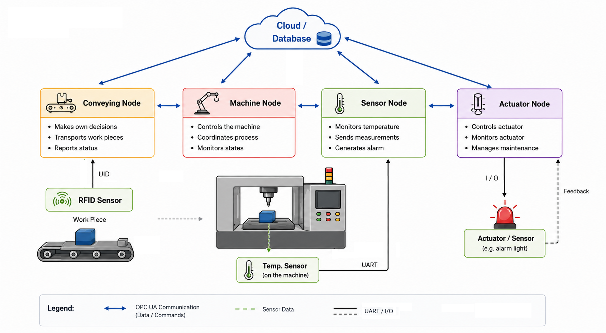

#  Industrial IoT / Industry 4.0 demonstrator

This project was originally developed in 2018/2019 as part of a Master's research project at FH Vorarlberg.
The focus was on demonstrating modular Industry 4.0 concepts using low-cost embedded hardware and OPC UA communication.
The system consists of modular industrial nodes (sensor, actuator, transport and machine nodes) communicating in a decentralized architecture inspired by Industry 4.0 concepts.

In this project a OPC UA distribution from https://open65421.org and wiringPi library from http://wiringpi.com was used.

For further details see the original documentation for further details.

[PDF Documentation](https://github.com/degersti/IoTNode/blob/master/docs/iotnode-documentation.pdf)

## The Concept

  

## Build Requirements

- Raspberry Pi OS
- GCC
- open62541
- wiringPi

## Repository Structure

- `/sensorNode`
  OPC UA sensor node implementation

- `/actuatorNode`
  Actuator and maintenance node

- `/machineNode`
  Simulated machine controller

- `/transportNode`
  RFID-based transport node

- `/hwTest`
  Hardware interface and GPIO test programs

- `/master`
  Startup and node configuration handling

- `/docs`
  Documentation, diagrams and thesis excerpts
  
## Achivements and Open Points

### Actuator Node
The  node implements a basic OPC UA client that reads the `OVERHEAT` state from the sensor node and switches a GPIO output accordingly.  
The planned actuator feedback loop using an additional sensor input was specified in the concept but is not fully implemented in this prototype.
Also the maintainance counter specified is not yet implemented.

## Additional Notes

